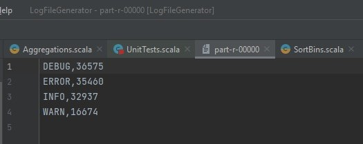
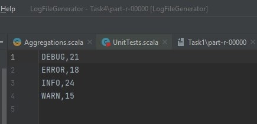
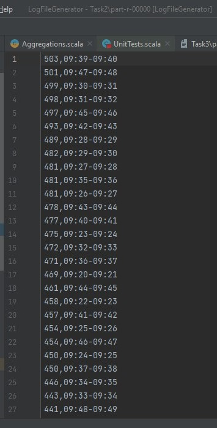
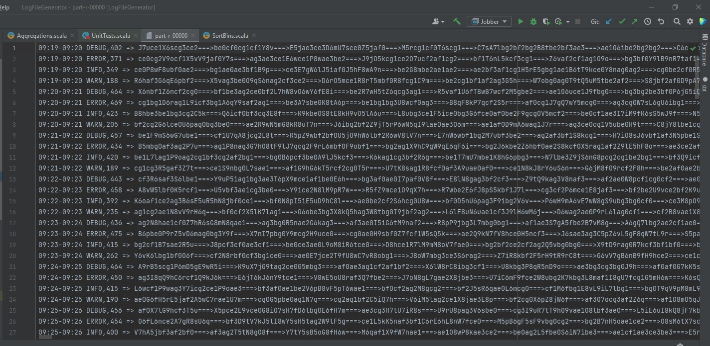

# CS 441 HW 2

## Introduction: This repository contains the programs necessary to run various jobs of Map/Reduce as detailed in the Functionality section of the readme at the root level of this repository.

## Project set up
+ Clone the project or download the repo in a zip format
+ Open a terminal at the root level of the repository
+ To run the test cases written for the simulations,

```
sbt clean compile test
```

+ To run the log generator

```
sbt clean compile run
```
+ To run the M/R jobs

```
sbt clean compile assembly
(in appropriate hadoop fs) hadoop fs jar-file.jar input/ output/
```

### Explanation video:

Google Drive- https://drive.google.com/file/d/1R5ZtMwe08oJCvnkmx12b8ey7N8dptQY-/view?usp=sharing
YouTube- https://youtu.be/3HQkevVeOUk

Includes explanation of code as well.

## Application Design

These are the main M/R files found in the src/scala directory:-
+ `WordCount` is the first M/R job executed by this program. It is Task 3 in the given functionality list, so its output will be placed in the Task 3 folder as well. This is a simple program of counting detected log message instances of the 4 types present in the log messages. This detection is configurable through the application.conf file and currently its set to all 4 instances of INFO, WARN, DEBUG and ERROR. Mapper collects the key as one of the detected log message type and puts a count of 1 for each. Reducer sums it all up by key and outputs as directed.

+ `MaxCharacters` is the second program written and consequently, executed by the run command. This is Task 4 in the functionality list. The Mapper detects injected log message instance according to the pattern and isolates the log message type as well. Once that is done, the mapper sets the key as the log message type and the value as the length of the injected string instance found by it. It is then sent to the reducer where a straightforward max() procedure is run on the iterable list to get the max count of characters for each log message type.

+ `SortBins` runs third and it is Task 2 in the functionality list. Only ERROR messages are isolated here (configurable) among the messages along with a check for the injected string pattern, the bin interval is set to 1 minute for this task. Once that is done, the time bins are created by looking at the log message in question and creating a bin whose start minute is the log message to the minute and the end minute is generated 1 minute ahead of the start minute obviously. The generated bin minute is checked for edge cases as well. This bin becomes the key and the value is just a 1 so that it can be summed up in the reducer. The reducer duly does it and gives a complete list of bins with the corresponding amount of error messages. For the task of arranging it in a descending order of error message frequency, another M/R job is run where the output of the first M/R is fed as input to the second Mapper. Here, the key and values are swapped. This allows the Mapper to sort by key, which is now the error message frequency as we desire. The Mapper by default sorts it in ascending order so a custom `IntComparator` class is used to sort it in descending order. The second reducer basically just outputs the values as it receives it.

+ `Aggregations` is the first task given in the functionality list. The same logic of binning is used here as the previous `SortBins` class, with a slight addition. The type of logged message is now grouped with the key, thus the key becomes, for example, "22:43-22:44 INFO". The value is set to the injected string instance as found by the mapper. Thus when these key value pairs are sent to the reducer, we receive 4 keys for each binner interval pertaining to the different log message instance types. The reducer groups these keys up and prints all the injected string instance in that bin for that particular log message type. Next up, to aggregate and get the count of the injected string instances per such entry, another M/R job is run. In the second mapper, the value which is the entire string is split into a list, to take the size of the list and determine the amount of injected string instances. The list is again restored as it was before with this new information added in as the count of injected string instances. This is now sent to the reducer which again does not do anything and prints it straight to output.


## Job results

1. Task 3 WordCount:-

<p align="center">
  
</p>


2. Task 4 MaxCharacters:-

<p align="center">
  
</p>


3. Task 2 SortBins:-

<p align="center">
  
</p>


4. Task 1 Aggregations:-

<p align="center">
  
</p>